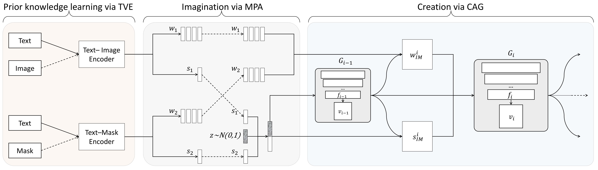

# LeicaGAN

Pytorch implementation for Paper [Learn, Imagine and Create: Text-to-Image
Generation from Prior Knowledge] by Tingting Qiao, Jing Zhang, Duanqing Xu, Dacheng Tao. (The work was performed when Tingting Qiao was a visiting student at UBTECH Sydney AI Centre in the School of Computer Science, FEIT, the University of Sydney).



## Getting Started
### Installation

- Clone this repo:
```bash
git clone https://github.com/qiaott/LeicaGAN.git 
cd LeicaGAN
```

- Download our preprocessed data from [here](xxxxx).

### Pretrain the Text-Visual co-Embedding models

##### 1. Train the text-image encoder:
```bash
./do_pretrain_TI.sh
```

##### 2. Train the text-mask encoder:
```bash
./do_pretrain_TM.sh
```

### Train and test the text2image generation model

##### Train the model:
```bash
./do_train.sh
```
##### Test the model:
```bash
./do_test.sh
```

## Citation
If you find our work useful for your research. please consider citing:
```bash
@incollection{LeicaGAN,
title = {Learn, Imagine and Create: Text-to-Image Generation from Prior Knowledge},
author = {Qiao, Tingting and Zhang, Jing and Xu, Duanqing and Tao, Dacheng},
booktitle = {Advances in Neural Information Processing Systems 32},
pages = {885--895},
year = {2019}
}

```